# Hybrid Methods for Finite Element Meshing

This project was my third year undergraduate dissertation which I worked on during time at 
the University of Nottingham, this read me provides a bried overview of the dissertation writeup which can be viewed here:
[./psyjb4_Jack_Bradbrook_dissertation.pdf](psyjb4_Jack_Bradbrook_dissertation.pdf)

## Overview

The goal of this project was to design a system by which could apply heuristic rules in conjunction with another already proven method
in order to speed up an often slow numerical method prominent across various engineering domains called "Finite Element Analysis"

The Finite Element(FE) Method takes some space represented as a mesh structure and attempts to calcuate some property across the mesh using
equations which can be used to determine the distribution of that property across the mesh space 
after running the finite element method. 

I was inspired to do this project after working at a large aerospace company where I routinely observed engineers
running finite element simulations that routinely took longer than 6 hours to conduct, the same engineers would often
express frustration at how predictable the results 

The speed and accuracy of an FE simulation is largely determined by the number of elements - cells within the mesh,

* More elements -> more calculations which need to be performed, 
time complexity for solving finite element problems varies but typically scales much worse than linearly.

* More elementsin a region -> greater accuracy of results for that region.

It is therefore advantagious to have more elements within the mesh in areas where higher accuracy is required and fewer in areas where it is not.

Normally to determine where the mesh should be refined to a higher fidelity several iterations are run of the model with gradually finer meshes
so as to establish which part of the mesh is of greatest interest, once this is done further refinement can be focused exclusively in those areas.

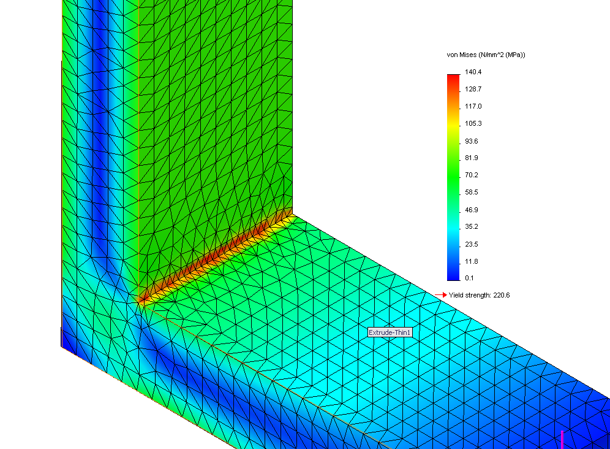

For this project I looked at the possibility of speeding up this process further by building a system which could store and apply heuristics that describe
where it would be most benificial for the mesh to be refined. These could could then be applied to the mesh refining sections of importance
without needing to rely  as heavily on the traditional approach which would run several solve iterations first to determine these areas.

Finally using both methods it was then possible apply each of different amounts to a series of models to attempt to determine how effective each approach was
and to what degree.

## Tasks / Methodology

The project can be broken down into several key components:

1. Create Interface with finite element solver which given a mesh and some additional parameters for describing the problem to be solved
for this project I focused on the application of FE to structural analysis problems

2. Build internal data structure to represent mesh and write a traditional stress based refinement method

3. build a heuristic refinement method which could use both engineering knowledge about a particular problem and inherent 

4. Analyse models, see what the improvement in accuracy was for each method and at what cost in terms of time overhead and elements created  

## Design of project
To allow for flexible design in order to incorporate required changes from experimentation the software was broken down into several main main subsystems

### FE Solver and Interfacing

For solving each mesh I used a finite element application known as [LISA](http://www.lisa-fet.com/) 
Interfacing with LISA was achieved through reading and writing LISA input and output files (.liml) 
an XML based Markup Language LISA could then be called with this as a parameter

### Mesh Structure

The internal structure representing the mesh had to be both easy to modify by the different refinement processes and
flexible so as to support almost any mesh structure.

So the solution could generalise for different types of meshes it needed to support different shapes of elemets.
This is important since element shapes selected by FE engineers can vary from model to model, often depending
on the geometry of the structure represented by the mesh. 
For example a structure which is large but relatively thin such as a water tank or a submarine hull 
may be represented using 2d elements which are computationally much expensive to perform the calculations for
while retaining much of the accuracy due to the thinness of the structure

To reslove this problem within the solution a class higherarchy was used. This provided a common element interface 
through which high level algorithms to transform and analyse the mesh as a whole regardless of the 
underlying design of the specific mesh. 

Code bespoke to each element does need to be written as part of the class for that respective element however,
this includes code to divide an individual element into further sub elements and calculation of
any element level metrics e.g. Area. 

Below can be seen the structure of the systems class higerarchy design along with 
different elements shapes commonly used that can be encorporated into it, 
unfortunately the only branch that was fully implemented was that of the 
Quad4 element.

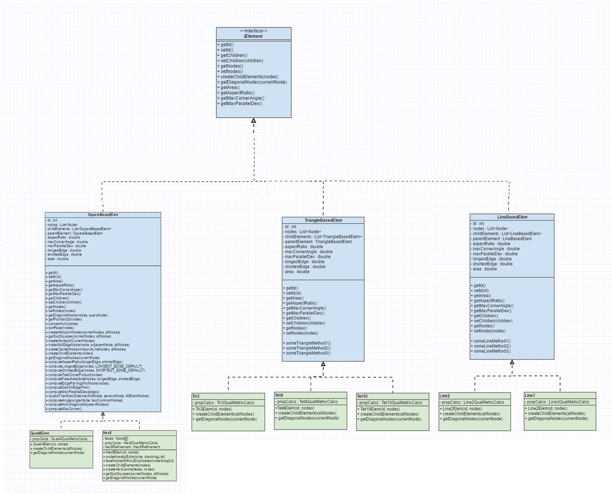

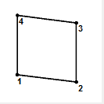
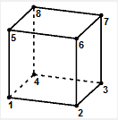
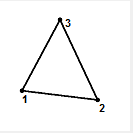
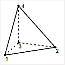
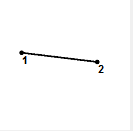
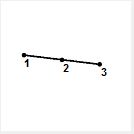

### Stress Refinement
To implement a traditional stress based refinement method all that was required was to run the initial mesh using the LISA 
solver, read the output file containing stress data and map this back into the model

The mesh could then be queried to find those areas where stress was higest e.g. greater than 80% and then
delegate the task of subdividing elements in those areas to the elements themselves which were 
returned by the query.

Repeating this process multiple times refined meshing in those areas of high stress

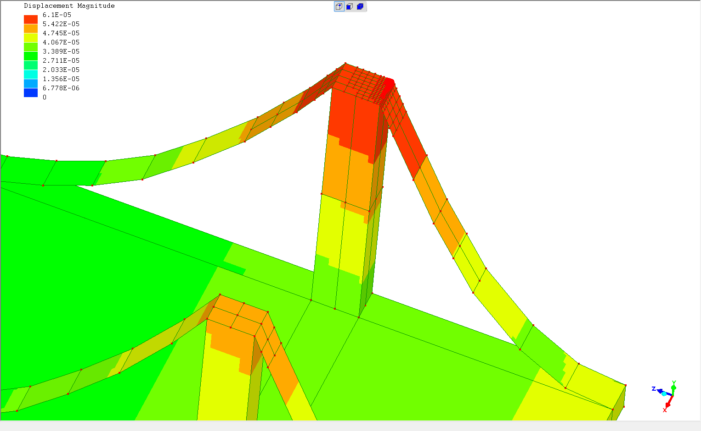

### Heuristic Refinement

Although it seemed quite possible that the use of heuristics would speed up the problem of FE mesh refinement
the body of research on the topic was very small despite the field of FE being very large.

Initially there was no clear way in which to represent the kind of tacit knowledge many engineers until eventually
a research paper which detailed a series of rules that had been generated using a machine learning technique 
known as Inductive Logic Programming, see dissertation for more info.

These rules were designed so as to designate refinement areas based on

* Engineering knowledge about the specific model which can be taken as input that could be provided by an engineer
* Generalised knowledge embedded within the rules when they were created about general based on the machine learning method.

Each rule describes meshing that should occur in terms of the location of key edges within the structure.
Edges were convenient as a descriptor for heuristics since they play a big part in defining the shape of a model
and often indicate where sections or materials change which are commonly the areas with the greatest weaknesses

The format of the rules described in the research paper was as follows:

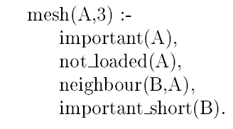

This rule says refine edge A three times where 

1. edge A is considered important by the engineer,
2. edge A does not run along a surface which is loaded directly by a force
3. edge A is a neighbour to some other edge B
4. edge B is considered by the engineer as important and short

Below is half of a cylinder of a cylinder that has had it's edges labelled 
so that it can be meshed using these rules.

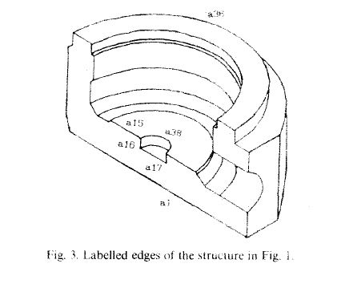

Re applying all the rules repeatedly across all edges in the model would therefore ideally result in a mesh refined in those
areas of importance without the need for costly stress refinement.

### Combining both methods
Having implemented both these approaches it was desirable to compare the two and see if some new hybrid method could be
generated which combined them both simultaniously 

Due to the limited time available to work on the project I was not able to develop a sophisticated approach of combining the two
instead opting to simply allow each of the methods to make some varying number of refienment iterations before re running the 
updated mesh through the solver to obtain more stress data with which the stress refinement method could use to continue refinement.
With each weighting for a model running on a different thread a large number of experiments could be performed quickly.

### Analysis
Finally it was important to evaluate the effectiveness of each method in order to determine whether this approach 
could be beneficial when applied to real engineering problems. For this problem domain the most important metric of effectiveness
was how much additional accuracy could be obtained by each method and at what cost was this accuracy obtained 
in terms of number of elements created by the method. 

This could be calculated as the average accuracy increase across a particular methods meshing region per additional element.

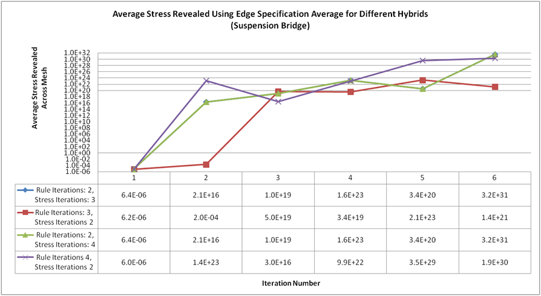
System rapidly focusing on stress concerntration points after just a few iterations

### Conclustion
In conclusion use of a heuristic approach was beneficial over stress based refinement in cases where engineer edges of interest were well designed
for this project I was only able to use models consisting of tens of thousands of nodes but in reality the true benefits of this approach may
only be made fully clear if the method is tested with complex models containing hundreds of thousands of elements. 

## Downloading and Running

To download the project from GitHub use:
`git clone https://github.com/WizardInTheCave/DissertationFEPrototype`

It shouldn't be too difficult to set up and make modifications to the software, the whole application can 
be loaded easily within Visual Studio using "DissertationFEPrototype.sln" from where documentation describing 
the workings of the different modules is clearly described using C# doc comments. 

Alternatively the doc comments have also been used to generate a full set of developer documentation using the tool Doxygen

Also make sure that:

1. LISA is installed on your local machine and the windows path variable has been configured 
so the project can call it directly from the command line. 
Note: LISA is proprietary software with the trial version free and the full version which allows creation of more than 1300 elements requiring purchase.
This means when you run the system LISA will throw an error to it after several iterations at which point no additional meshes will be generated.

2. Make sure the paths to the liml files and experiment folders are also configured for your local machine, 
currently these are hard coded within the Control and Program classes.

3. Make sure you have at least .Net 4.0 installed

4. Before running the tool ensure that loads and constraints are correctly set by refering to 
[LISA Manual](http://www.lisafea.com/pdf/manual.pdf)  